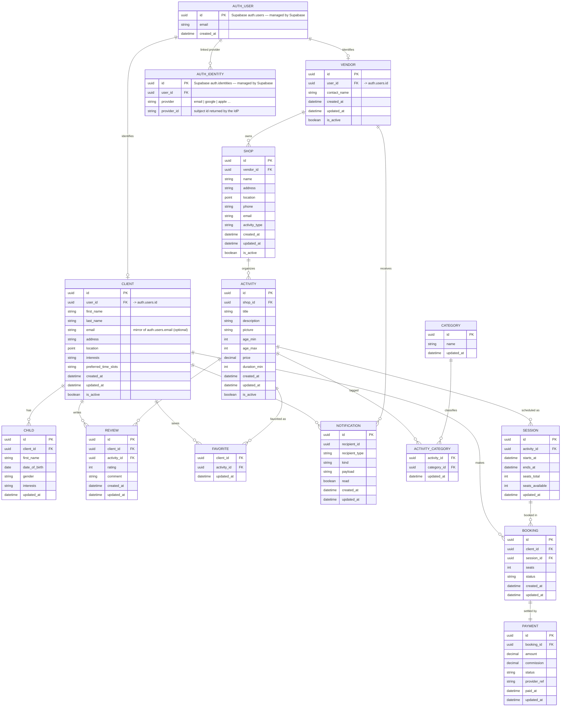

# Data model — first draft

Derived from [brainstorming-en.md](brainstorming-en.md). This is an **initial conceptual model** for discussion, not a final schema. Open questions and assumptions are listed under the diagram.

## Entity-relationship diagram

## Core entities

| Entity | Meaning | Source in brainstorming |
|---|---|---|
| **Auth User** *(Supabase)* | Canonical login account; source of truth for identity/email. Managed by Supabase Auth. | Log in (Client & Vendor) |
| **Auth Identity** *(Supabase)* | One linked sign-in provider (email, Google…) per user; enables account linking. Managed by Supabase Auth. | Log in / delegated auth |
| **Client** | A parent *profile* attached to an auth user. | Client sign-up form, vocabulary |
| **Child** | A child attached to a client; drives age/interest matching. | Children sign-up form |
| **Vendor** | The account that manages one or more shops. | Vendor page, vocabulary |
| **Shop** | The entity that organizes activities. | Vocabulary ("Shop") |
| **Category** | Activity classification for filtering/search. | Filters, categorization |
| **Activity–Category** | Join linking an activity to each of its categories (many-to-many). | Filters, categorization |
| **Activity** | A bookable offering by a shop; inherits the shop's location. | Activities page, vocabulary |
| **Session** | A dated occurrence of an activity with seat capacity. | Time-slot filter, seat availability (UC 22) |
| **Booking** | A client reserving one or more seats in a session. | Booking, use cases 1–2, 11–12 |
| **Payment** | The settlement of a booking, net of commission. | Payment solution, UC 21 |
| **Review** | A client's rating/comment after an activity. | Reviews, UC 13 |
| **Favorite** | A client bookmarking an activity. | Favorites |
| **Notification** | Email / in-app message to a client or vendor. | Notifications section |

## Assumptions

Decisions already settled that this model reflects. They are stable ground unless revisited deliberately.

1. **Auth (delegated, Supabase-native).** Login is delegated to an identity provider via **Supabase Auth**. The canonical account is `auth.users` (`AUTH_USER`); each linked provider — email/password, Google, etc. — is a row in `auth.identities` (`AUTH_IDENTITY`), so the "authentication method" is a **one-to-many** set of linked identities, not a single field. Both tables are **managed by Supabase** (shown greyed conceptually; we don't create or own them, and we never store passwords). Our domain profiles link in via `Client.user_id` / `Vendor.user_id` → `auth.users.id`. Email is owned by the auth layer and only optionally mirrored onto the profile.
2. **Separate Client and Vendor accounts.** A person is either a Client *or* a Vendor — there is no shared account bridging the two profiles. Each profile references its own `auth.users` row independently. (If a single login ever needs both roles, this becomes a shared `USER` + role model — a schema change to revisit then.)
3. **Entities vs. value objects (auditing & soft deletion).** `updated_at` is carried by **every** object, to track last modification. `is_active` (soft deletion — deactivate rather than hard-delete) is reserved for the **entities** only: **Client, Vendor, Activity, and Shop**. The other tables (Child, Category, Session, Activity–Category, Booking, Payment, Review, Favorite, Notification) are value objects / records within an aggregate — they get `updated_at` but no independent soft-delete lifecycle, and are removed with their owner or kept as immutable history.
4. **Activity vs. Session (validated).** The schedule is split into a separate `SESSION` entity so seat availability (UC 22) and time-slot filtering attach to a specific date/time rather than the activity itself.
5. **Location / geo (validated).** `location` is a `point` (lat/lng) carried by **Shop** and **Client** only. An **Activity inherits its Shop's location** via `shop_id` (a shop is, for our concern, just a location) — activities have no location of their own. Client location supports proximity search.
6. **Category cardinality (validated).** An activity can have **multiple categories**: the link is a many-to-many join (`ACTIVITY_CATEGORY`), not a single `category_id` on the activity.

## Open decisions

Unresolved choices that will require future work before the schema is finalized. Each changes the shape of one or more tables.

1. **Seats & availability.** `seats_available` is modeled as a counter on `SESSION`. It could instead be derived by summing bookings — a consistency-vs-simplicity trade-off.
2. **Vendor ↔ Shop.** Assumed one vendor may own several shops. If it's strictly one shop per vendor, the two can merge.
3. **Notification polymorphism.** `recipient_id` + `recipient_type` point to either a client or a vendor. An alternative is separate notification tables per audience.
4. **Not yet modeled** (out of the MVP data core, will need their own modeling later): reviews of the *site* (vs. of an activity), community, chatbot, admin analytics (visitors, clicks, visit duration), booking sharing (UC 20).
