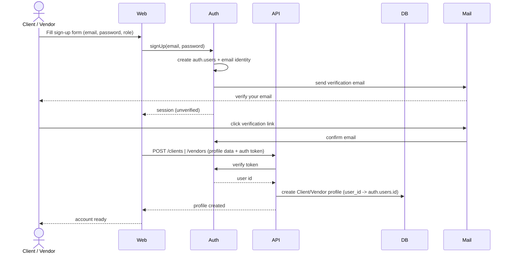
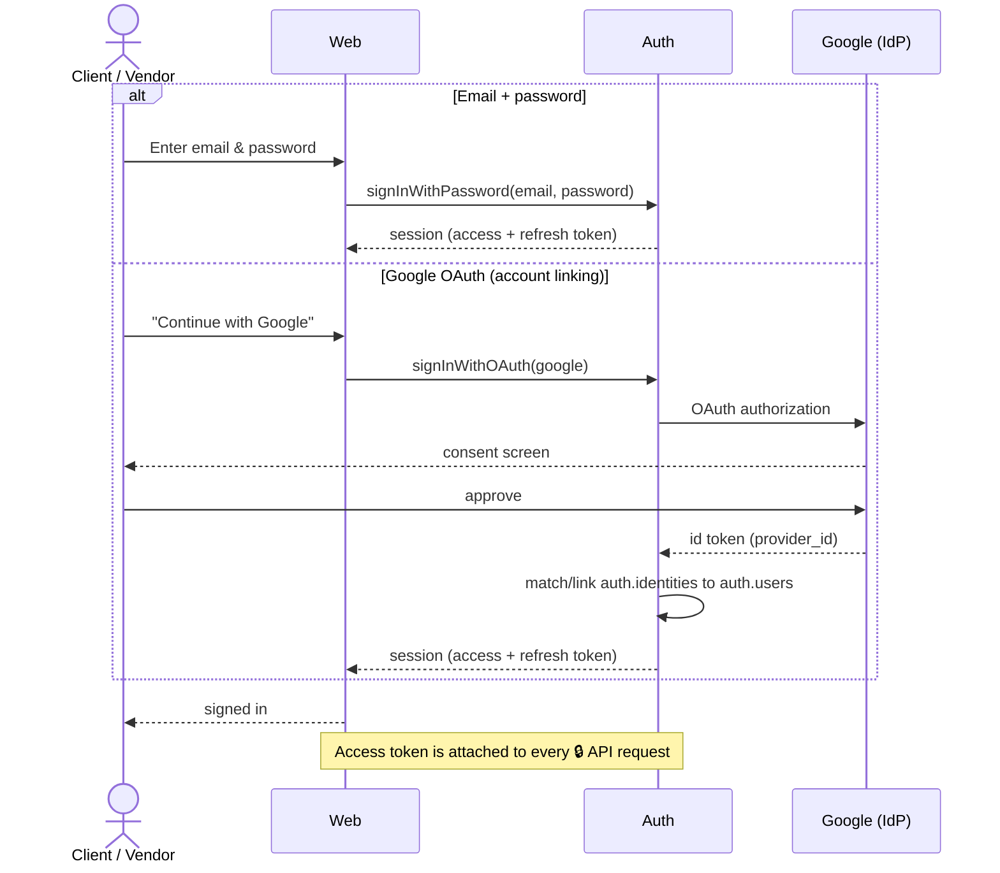
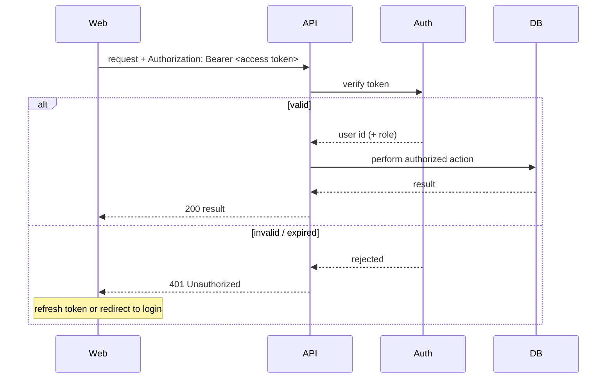
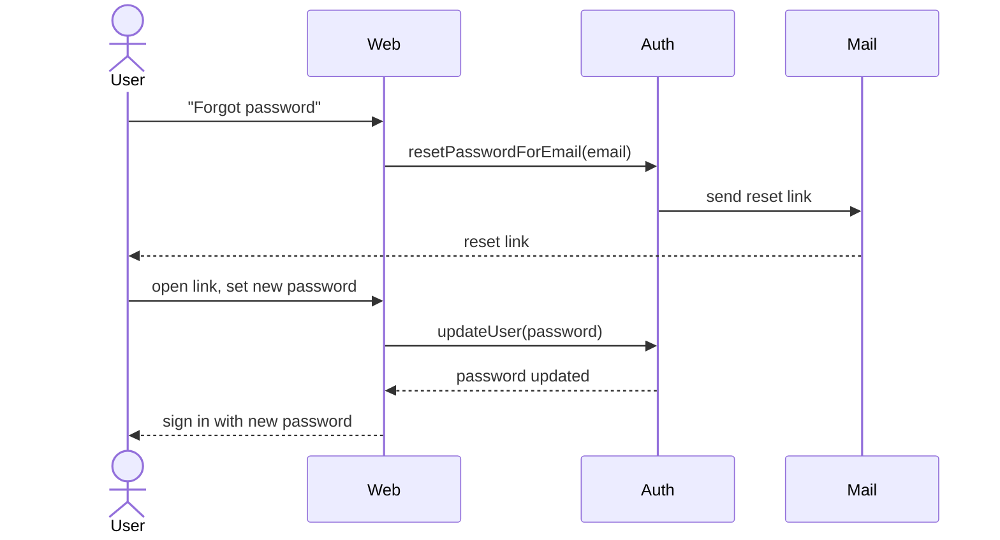

# 0. Authentication

[← Index](README.md)

Prerequisite for every 🔒 flow. Login is delegated to **Supabase Auth**; the same account model serves Client and Vendor (separate accounts). These flows are referenced by all authenticated use cases rather than repeated in them.

## A. Sign up — create a Client or Vendor account

## B. Log in — email/password or Google (delegated)

## C. Authenticated request pattern (reused by every 🔒 flow)

## D. Password reset — email/password accounts

---

[← Index](README.md) · [Next: Discover activities →](01-discover-activities.md)
