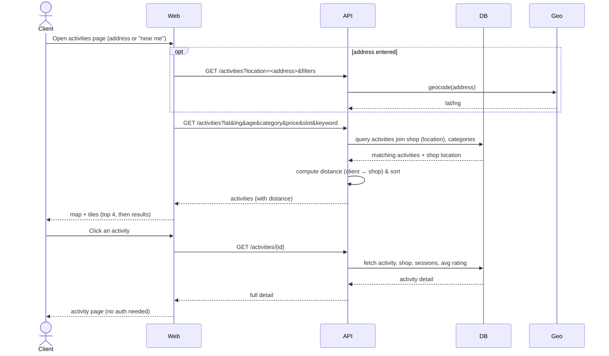

# 1. Discover activities nearby & view details — UC 3, UC 4

[← Index](README.md)

🔓 **Public** — no authentication required.

---

[← Authentication](00-authentication.md) · [Index](README.md) · [Next: Book & pay →](02-book-and-pay.md)
