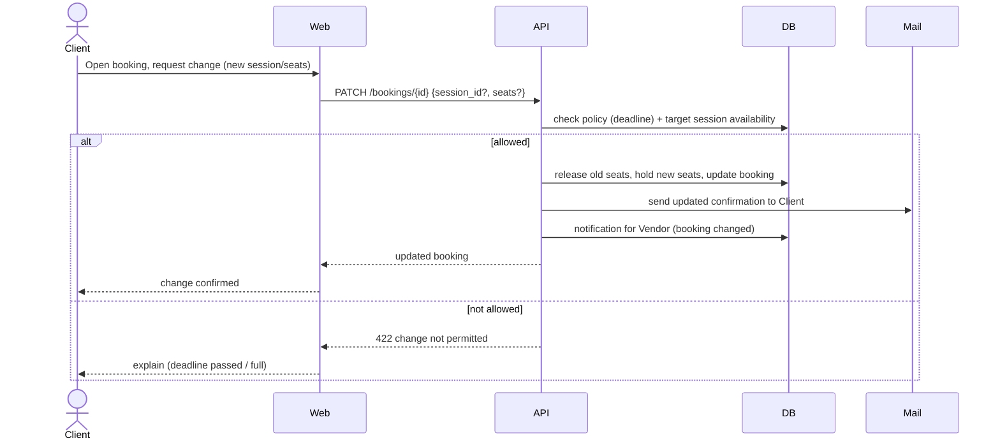

# 3. Change a booking — UC 11

[← Index](README.md)

🔒 **Requires authentication** (Client) — acts on the client's own booking.

---

[← Book & pay](02-book-and-pay.md) · [Index](README.md) · [Next: Cancel & refund →](04-cancel-refund.md)
