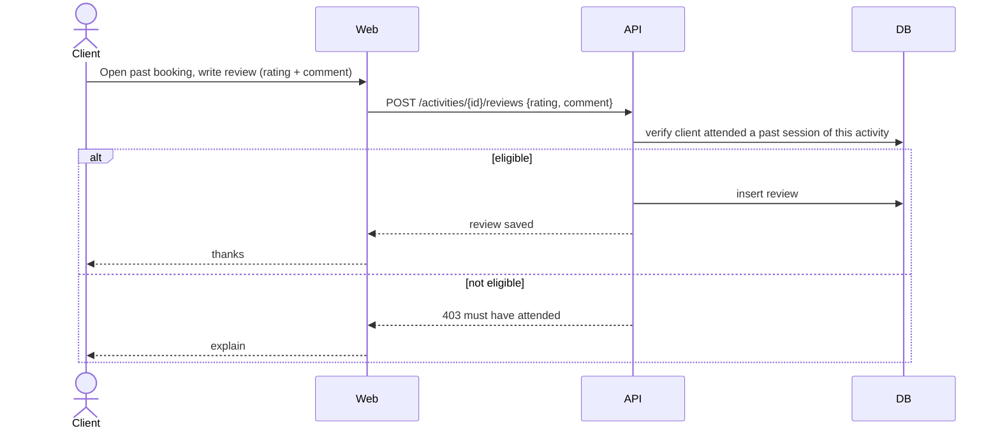

# 5. Review an activity after attending — UC 13

[← Index](README.md)

🔒 **Requires authentication** (Client) — and prior attendance is verified.

---

[← Cancel & refund](04-cancel-refund.md) · [Index](README.md) · [Next: Client personal space →](06-client-space.md)
