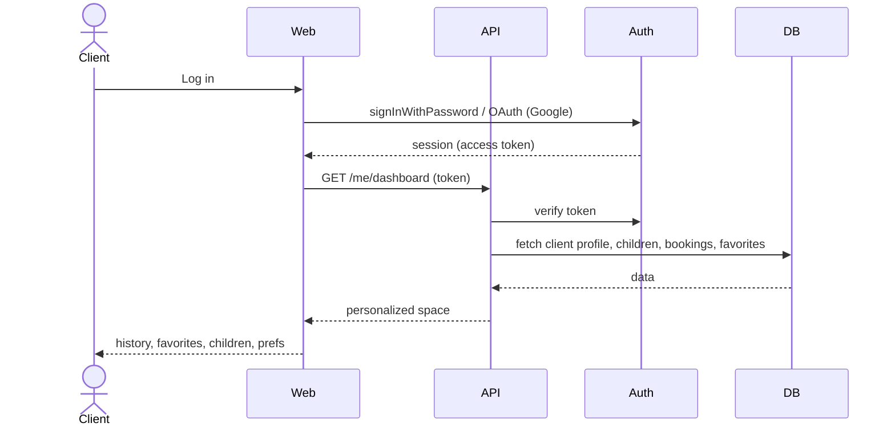

# 6. Client personal space — UC 6

[← Index](README.md)

🔒 **Requires authentication** (Client). The login shown here is the [Authentication](00-authentication.md) flow, included inline because this is the entry point to the authenticated area.

History, favorites, children, preferences.

---

[← Review](05-review.md) · [Index](README.md) · [Next: Vendor management →](07-vendor-management.md)
