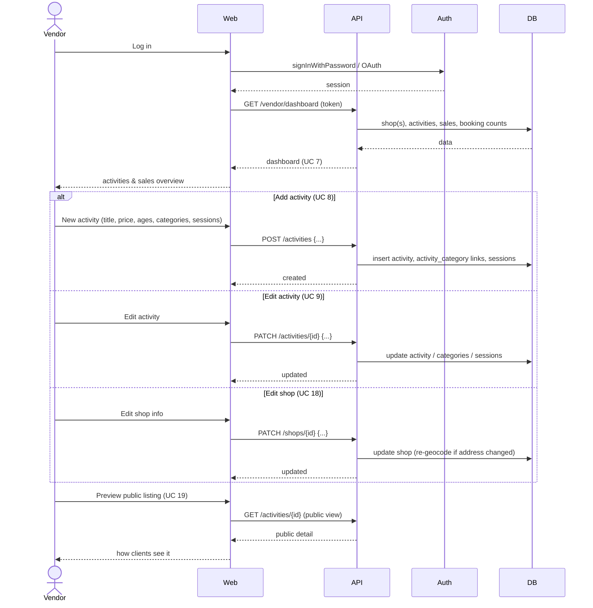

# 7. Vendor manages shop & activities — UC 7, UC 8, UC 9, UC 18, UC 19

[← Index](README.md)

🔒 **Requires authentication** (Vendor). Login shown inline as the entry point to the vendor area.

Dashboard, add/edit activity (with categories & sessions), edit shop, preview.

---

[← Client personal space](06-client-space.md) · [Index](README.md) · [Next: Vendor cancel/reschedule →](08-vendor-cancel-reschedule.md)
