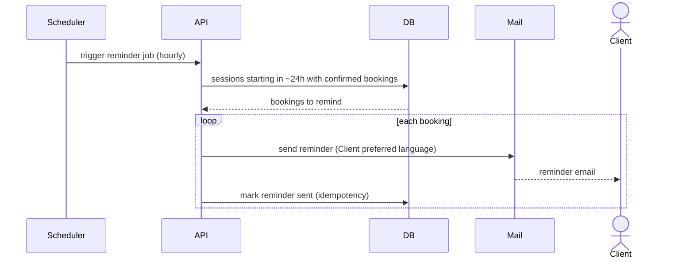

# 9. Reminder 24 h before an activity — UC 10

[← Index](README.md)

⚙️ **System flow** — no user session; runs as a trusted scheduled job (no end-user authentication).

Time-triggered, no user in the loop.

---

[← Vendor cancel/reschedule](08-vendor-cancel-reschedule.md) · [Index](README.md) · [Next: Contact support →](10-support.md)
