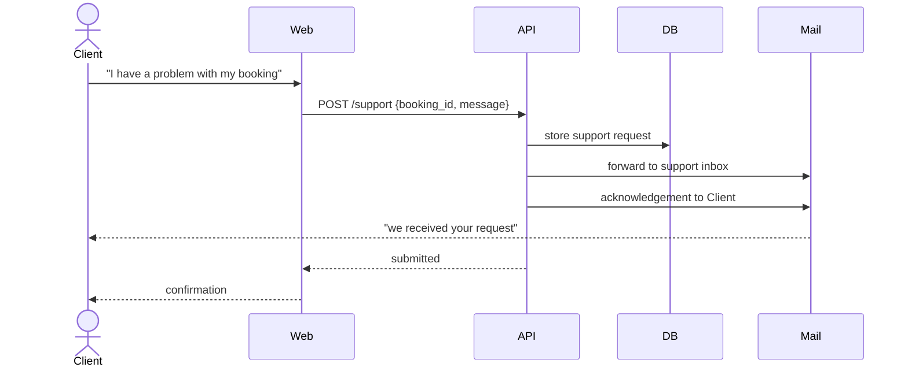

# 10. Contact support about a booking — UC 14

[← Index](README.md)

🔒 **Requires authentication** (Client) — request is tied to the client's booking.

> Open decision: *who* handles support (see brainstorming UC 14 "who?"). Modeled here as a support inbox.

---

[← Reminder 24 h](09-reminder.md) · [Index](README.md) · [Next: Share a booking →](11-share-booking.md)
