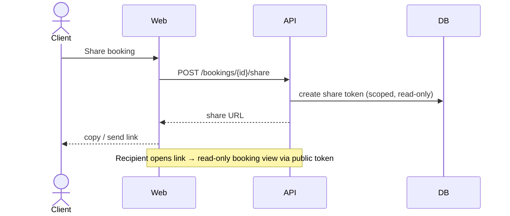

# 11. Share a booking — UC 20

[← Index](README.md)

🔒 **Requires authentication** (Client) to create the share link; 🔓 the recipient opens a read-only view via a scoped public token (no account needed).

> Open decision: *share with whom* and *what mechanism* (see brainstorming UC 20 "share? users = clients?"). Modeled here as a shareable link.

---

[← Contact support](10-support.md) · [Index](README.md)
